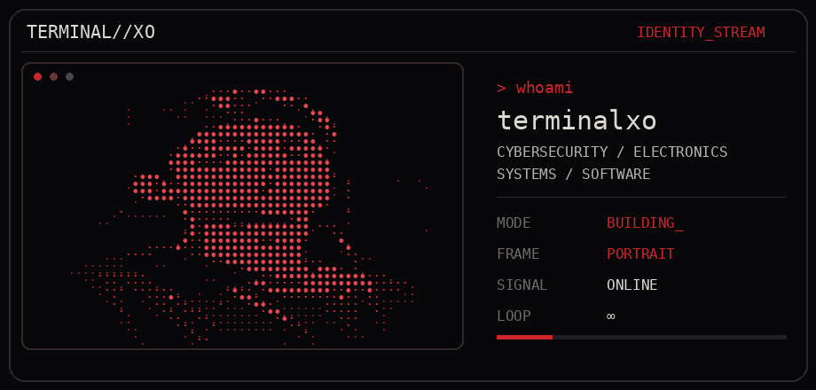
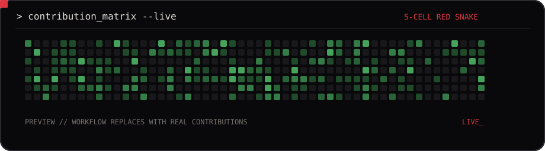

<div align="center">



<br/>

<a href="https://github.com/terminalxo"></a>
<a href="mailto:terminalX0.apple@gmail.com"></a>
<a href="https://youtube.com/@TerminalX0"></a>
<a href="https://instagram.com/terminalX0"></a>
<a href="https://discord.gg/wNg9EMpxMF"></a>

<br/><br/>

`CYBERSECURITY` · `ELECTRONICS` · `SYSTEMS` · `SOFTWARE`

</div>

---

## `01 // WHOAMI`

```console
terminalxo@github:~$ whoami
terminalxo

terminalxo@github:~$ cat ./focus
cybersecurity / ethical hacking
hardware & electronics
systems / automation
software engineering

terminalxo@github:~$ status
BUILDING_
```

I like understanding what is happening **under the hood** — whether that means tracing software through a system, taking apart a protocol, wiring hardware, or turning an idea into something that actually runs.

> **// build → break → understand → rebuild**

---

## `02 // SIGNAL`

<table>
<tr>
<td width="33%" valign="top">

### `SECURITY`

Network & system security  
Privacy & anonymity  
Security tooling  
Ethical hacking

</td>
<td width="33%" valign="top">

### `ELECTRONICS`

Arduino  
Raspberry Pi  
Hardware experiments  
Embedded curiosity

</td>
<td width="33%" valign="top">

### `BUILD`

Web & desktop  
Automation  
Systems tooling  
Open source

</td>
</tr>
</table>

---

## `03 // ARSENAL`

<div align="center">

### `LANGUAGES + FRONTEND`


<br/><br/>

### `PLATFORMS + DATA + TOOLS`


<br/><br/>

`Windows Terminal` · `Tomcat` · `NumPy` · `Canva` · `Notion` · `Prettier` · `Tor`

</div>

<details>
<summary><code>cat stack.txt</code></summary>
<br/>

**Languages:** HTML, CSS, Java, TypeScript, Dart, C, C++, Python, Bash, Rust  
**Frameworks / runtimes:** React, Flutter, Bun, Tauri, Apache, Tomcat  
**Cloud / data:** Firebase, Google Cloud, MongoDB, Supabase, PostgreSQL, SQLite  
**Data / ML:** PyTorch, NumPy  
**Hardware / tooling:** Git, GitHub, Docker, Raspberry Pi, Arduino, Windows Terminal, Prettier, Tor  
**Design / productivity:** Figma, Canva, Notion

</details>

---

## `04 // PROJECTS`

```text
~/projects
├── 01  classified // loading...
├── 02  classified // loading...
├── 03  classified // loading...
└── ??  more experiments are always compiling
```

<!--
Replace the block above with 3–5 featured projects when ready.
Recommended format:

### PROJECT_NAME
One precise sentence explaining what it does and why it is interesting.
`TypeScript` `Tauri` `SQLite`
[repo](...) · [demo](...)
-->

<div align="right"><sub>projects > buzzwords</sub></div>

---

## `05 // CONTRIBUTION MATRIX`

<div align="center">

<!--
This SVG is generated from your REAL GitHub contribution calendar by the included workflow.
The five red blocks move continuously around the grid in a Nokia-Snake-style loop.
After you add the workflow and run it once, assets/live-heatmap.svg will be refreshed automatically.
-->



</div>

---

## `06 // TELEMETRY`

<div align="center">


<br/>


</div>

---

## `07 // RANDOM DEV TRANSMISSION`

<div align="center">


</div>

---

## `08 // OPEN CHANNEL`

<div align="center">

### `> connect --with terminalxo`

**GitHub** [`terminalxo`](https://github.com/terminalxo) &nbsp;·&nbsp;
**Email** [`terminalX0.apple@gmail.com`](mailto:terminalX0.apple@gmail.com) &nbsp;·&nbsp;
**YouTube** [`@TerminalX0`](https://youtube.com/@TerminalX0) &nbsp;·&nbsp;
**Instagram** [`@terminalX0`](https://instagram.com/terminalX0) &nbsp;·&nbsp;
**Discord** [`connect`](https://discord.gg/wNg9EMpxMF)

<br/>


<br/><br/>

```text
[ signal acquired ]
[ curiosity online ]
[ excuses not found ]
```

### `// GOOD THINGS TAKE TIME_`

</div>
